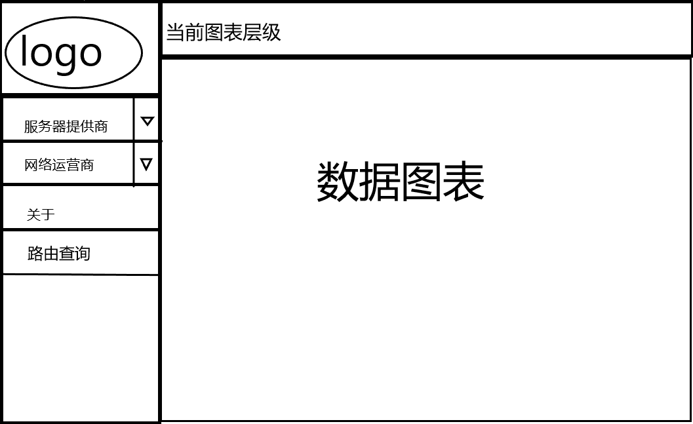
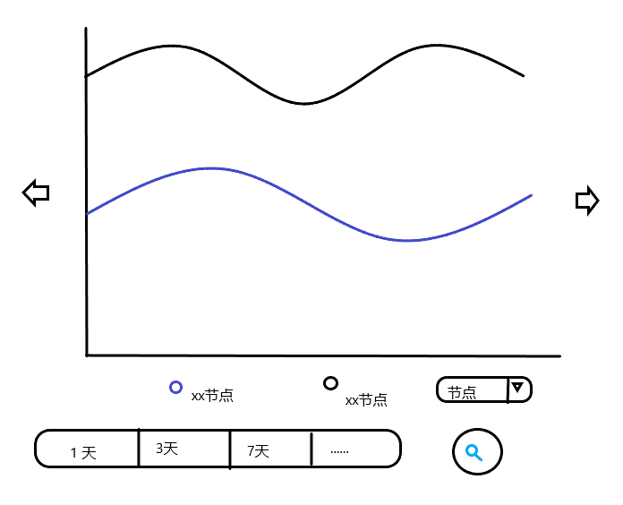
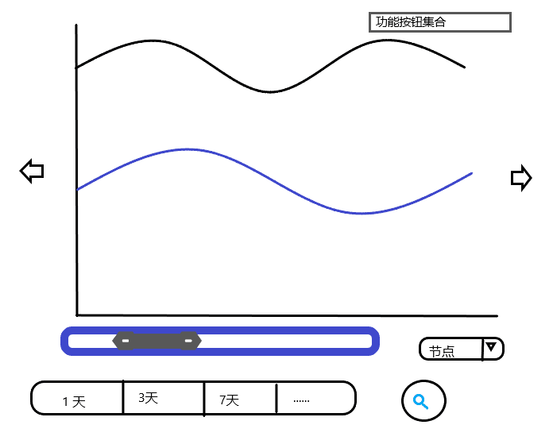
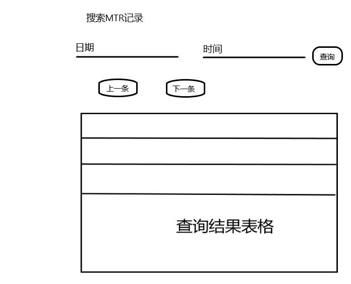

# 前端设计文档

## 前端基础框架

Vue.js 2.1.8

## 前端基本功能划分

### 主页面

1. 主页面需要包含必须的服务器提供商和当地网络运营商的选择功能

2. 主页面需要包含必要的网络数据展示界面，用户能够直接看到网络连接的质量图，无需跳至其他页面  

### 数据图展示界面

1. 需要包含简要的按钮，用户可以根据按钮操作来切换详细图表和通栏图表，保存图表为图片等功能

2. 可以通过鼠标拉取，滚轮操作来改变数据图的呈现

3. 网络数据图的横坐标为时间，纵坐标为延迟

4. 网络数据图的横坐标（时间）通过滚动条的方式来调整，用户可以根据自己的需求来查看任意时间的网络状况

5. 包含MTR（一个集合ping和traceroute功能并能直观显示结果的网络管理工具）展示的路由结果，用户可以根据自己的需求选择相应时间查询不早于给定时间的最旧一次路由结果，无需安装MTR或使用命令

## 页面设计图

### 主页面

### 通栏图表

### 详细图表

### 路由查询界面

## 功能层次

### 主页面

服务器提供商：用户点击右方倒三角拉取droplist选择测试的服务器提供商

网络运营商：用户点击右方倒三角拉取droplist选择测试的网络运营商

路由查询：用户点击后转入路由查询界面

### 数据图表（通栏图表和详细图表）

左右箭头：用户点击后切换图表

xx节点：用户点击后图表中相应数据图线将不可见，方便用户选择查看自己需要的图

节点：用户点击右方倒三角拉取droplist选择测试的目标地点

滚动条：用户用鼠标抓取滚动条来改变图表显示的时间范围

左下方的tab：用户根据需求点击1天/3天等时间选项来查看自己的所需时间内的数据图表

右下方放大镜图标：用户点击后更新图表

### 路由查询界面

日期：用户点击后选择需要查询的日期

时间：用户点击后选择需要查询的具体时刻

查询：用户点击后显示查询表格

上一条：用户点击后显示上一条查询记录

下一条：用户点击后显示下一条查询记录